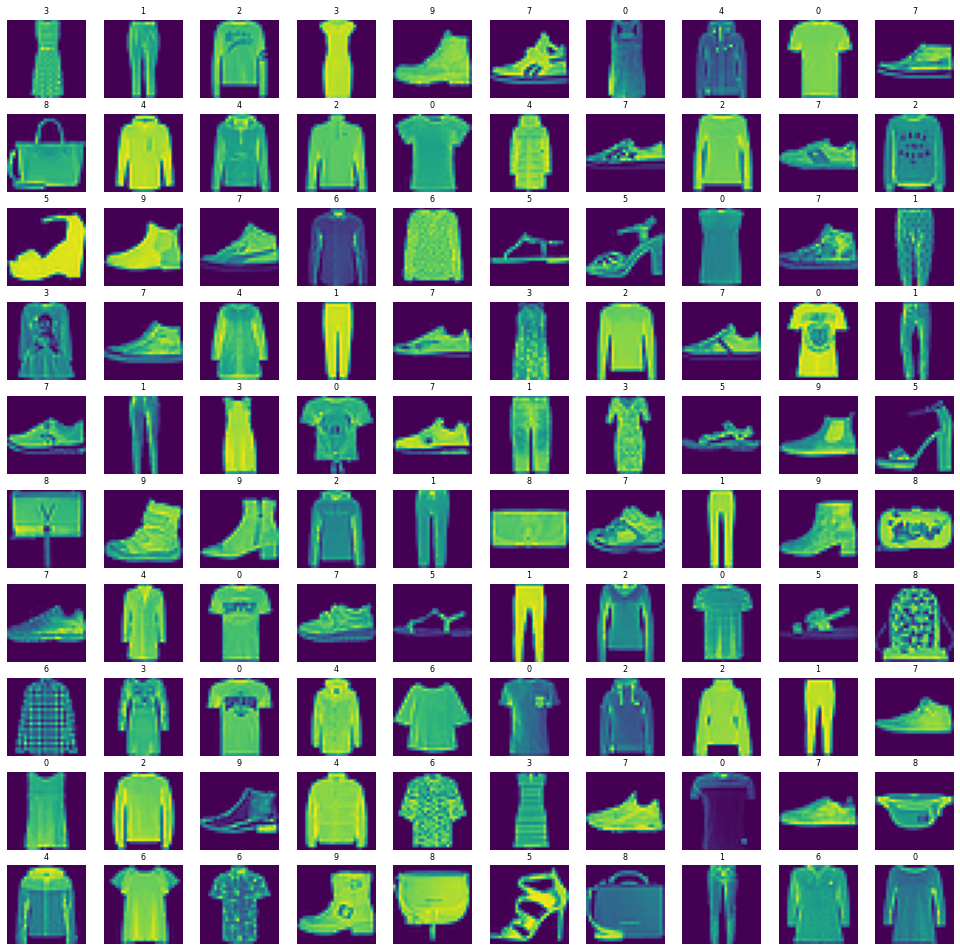
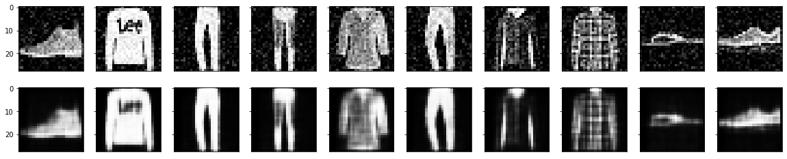

## Image Denoising Using Autoencoder 

Autoencoders are used to encode data. The images are fed into the input layers. 
The autoencoder finds the correspondence between the data given to the input layers
and then adjusts the weights according to the error produced at the output. They consist of 
an encoder and decoder n/w joined together. The encoder consists of normal convolutional layers,
followed by a bottleneck, which is then connected to the decoder, is a deconvolution n/w. The Autoencoder 
reduced the dimentionality of the input vector, similar to that of PCA(Principal Component Analysis). Hence, 
they can we used for variety of DL techniques llike representational learning and for building recommandation systems,
image classification and so on. The Autoencoder has the lowest hidden layer, which is of reduced dimention, compared
to the original image data, which is called the bottleneck, which forms the compressed image. The decoder then takes 
this and then upscales this to give the predicted image. The output image dimention would be the same as that 
of the input image data.

Encoder - h(x) = sigmoid(W*x + b)
 
Decoder - x^ = sigmoid(W*h(X) + c)

The model is build on Tensorflow 2.0 framework. The initial testing with 10 epochs seems to give good results, 
though we can further improve the predicted image quality with more training.   
The dataset taken was the tensorflow fashion dataset. 

Visualizing the dataset: 
The Autoencoder gives the following results after training: 
The first row is the data with noise, while the second row is the cleaned predicted data by the model
The performance of the model can be increased by training with more epochs.